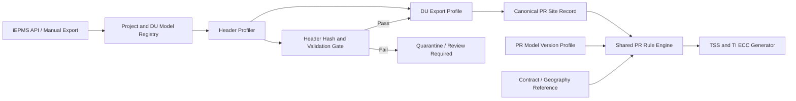

# MW Related DU Model Extension — Architecture and Implementation Plan

**Project:** `Gumb-D/create-pr-cd`  
**Document type:** Future development design and delivery plan  
**Version:** 1.0  
**Date:** 2026-07-06  
**Status:** Proposed baseline for implementation

---

## 1. Purpose

Extend the current CelcomDigi PR Creator from the existing **TX Mini DU Model** baseline to support **all MW-related DU Models** without duplicating PR-generation logic for every model.

The design must tolerate differences between DU Models, including:

- iEPMS export column names and column order;
- task/WBS structures;
- field IDs and display headers;
- SOW source fields and value formats;
- region, subcontractor, antenna, coordinate, and PR-status source fields;
- PR Model / Line Item workbook versions.

The intended outcome is a scalable onboarding process where a new MW DU Model is added through a validated profile and test fixtures, not by copying or branching the ECC generator.

---

## 2. Business Scope

### In scope

- All MW-related iEPMS DU Models that may require TSS or TI PR ECC generation.
- Ingestion of original iEPMS Export files and/or a controlled normalized site-data view.
- DU Model detection, schema profiling, field mapping, data validation, traceability, and quarantine.
- Existing PR rule-engine capabilities: TSS, TI, mandatory-item selection, geography, transport, simple packing, antenna selection, duplicate prevention, and `REVIEW_REQUIRED` handling.
- Versioned PR Model / Line Item compatibility.

### Current confirmed implementation scope

The current CLI generator supports only:

- `TSS`
- `TI`

Planning and Operation Backoffice remain future scopes and must not be silently enabled by this extension.

### Out of scope for the first delivery

- Automated approval of newly detected mappings.
- Silent use of unknown or changed iEPMS columns.
- Automated GIS decisions beyond already approved deterministic mappings.
- Changing commercial contract rules without business confirmation.
- Using iEPMS credentials, browser cookies, token values, employee numbers, or session identifiers in source control or knowledge-base files.

---

## 3. Current-State Assessment

### 3.1 iEPMS source hierarchy

The correct source hierarchy is:

```text
Project
  └── DU Model
        └── Export File
              └── Four-layer Header
                    └── DU Record / Site Record
```

A **DU Model** is a workflow/template/export view. It is not a single DU or a single site.

### 3.2 iEPMS column identity

Every iEPMS Export column must be identified through a four-layer fingerprint:

```text
column_fingerprint =
(
  Header Row 0: Field ID / Code,
  Header Row 1: WBS Stage,
  Header Row 2: Task Name,
  Header Row 3: Display Header
)
```

A fixed column index is not an acceptable production identifier because different DU Models and later export revisions may change column order.

### 3.3 Existing PR Creator input boundary

The current repository consumes a normalized input file:

```text
Info/input/site_pr_po_view.xlsx
```

The existing PR engine expects business columns such as:

- Site Code / Site ID;
- Tx SOW;
- TX Upgrade Scope;
- Region / State;
- TI subcontractor;
- latitude and longitude;
- MW antenna size at NE and FE;
- existing PR status.

It does **not** currently operate directly on a generic iEPMS four-header export. Therefore, the required extension is not only new Header aliases; it is a formal input-adaptation layer between iEPMS and the PR rule engine.

---

## 4. Target Architecture



### 4.1 Separation of responsibilities

| Layer | Responsibility | Must not contain |
|---|---|---|
| iEPMS Export Adapter | Read source export, detect DU Model, resolve four-layer headers, normalize values | PR line-item decision logic |
| Canonical PR Site Record | Store standard site-level business fields plus provenance | Raw model-specific Header logic |
| PR Rule Engine | Match TSS/TI rules, mandatory groups, transport, packing, antenna and duplicate controls | Model-specific column names |
| ECC Generator | Produce approved ECC rows/files | Rule interpretation or source parsing |
| Review / Quarantine Gate | Block unsafe sites and provide actionable reasons | Silent fallback or guessing |

### 4.2 Architecture rule

> A DU Model difference must be handled in a DU Profile wherever possible. A change to the shared rule engine is allowed only when the business rule itself changes for all applicable MW flows.

---

## 5. Canonical PR Site Record v1

All DU Export Profiles must transform their source data into the same canonical record before any PR rule is applied.

```yaml
canonical_pr_site_record:
  identity:
    project_key: "CelcomDigi_MW"
    project_id: "<iepms-project-id>"
    du_model_name: "<DU Model Name>"
    du_model_id: "<iepms-du-model-id>"
    view_id: "<iepms-view-id>"
    source_file_name: "<export-file-name>"
    source_file_hash: "<sha256>"
    header_hash: "<sha256>"
    source_row_number: 0

  site:
    site_code: "<mandatory>"
    site_name: "<recommended>"
    du_key: "<site or alternate approved DU key>"

  pr_context:
    tx_sow_raw: "<source value>"
    tx_sow_normalized: "<controlled canonical SOW>"
    tx_upgrade_scope_raw: "<source value>"
    region: "<normalized region>"
    state: "<normalized state>"
    subcontractor_ti: "<normalized TI subcon>"
    subcontractor_planning: "<if available>"
    existing_tss_pr_status: "<normalized status>"
    existing_ti_pr_status: "<normalized status>"

  technical_context:
    latitude: null
    longitude: null
    antenna_size_ne: "<raw or normalized>"
    antenna_size_fe: "<raw or normalized>"
    boq_configuration: "<optional raw evidence>"
    tx_sow_details: "<optional raw evidence>"
    ne_sow_details: "<optional raw evidence>"
    fe_sow_details: "<optional raw evidence>"

  source_evidence:
    fields:
      site_code:
        source_header_fingerprint: "<four-layer fingerprint>"
        source_value: "<raw source value>"
        transformation: "trim_uppercase"
      tx_sow_raw:
        source_header_fingerprint: "<four-layer fingerprint>"
        source_value: "<raw source value>"
        transformation: "none"

  validation:
    profile_id: "<profile id>"
    profile_version: "1.0"
    pr_input_classification: "PR_INPUT_READY"
    blocking_reasons: []
    warnings: []
```

### Required canonical fields by scope

| Field | TSS | TI | Notes |
|---|:---:|:---:|---|
| `site_code` | Required | Required | Stable site/DU key required |
| `tx_sow_normalized` | Required | Required | Must map to supported PR Model SOW |
| `region` | Required | Required | Required for grouping and purchasing area |
| `subcontractor_ti` | Required | Required | Contract mapping depends on this |
| `existing_*_pr_status` | Required | Required | Required for duplicate prevention |
| `latitude`, `longitude` | Conditional | Conditional | Mandatory when a selected item requires geography |
| `antenna_size_ne`, `antenna_size_fe` | No | Conditional | Mandatory only when matching TI PR Model contains an antenna-dependent choose group |
| `tx_upgrade_scope_raw` | Conditional | Conditional | Required when dismantling/simple packing logic applies |

---

## 6. DU Export Profile Specification

Each DU Model must have its own versioned profile. Profiles should be configuration-first and stored in source control.

```text
config/
  du_profiles/
    tx_mini_pr_v1.yaml
    mw_eos_swap_pr_v1.yaml
    jendela_tx_migration_pr_v1.yaml

  pr_model_profiles/
    tx_pr_model_v3_0.yaml
    tx_pr_model_v3_2.yaml

  registries/
    mw_du_model_registry.yaml
    canonical_sow_registry.yaml
```

### 6.1 Profile example

```yaml
profile_id: mw_eos_swap_pr_v1
profile_version: "1.0"
status: DRAFT

identity:
  project_key: CelcomDigi_MW
  accepted_du_models:
    - MW EOS Swap
  accepted_du_model_ids:
    - "5440935430300168497"
  accepted_view_ids:
    - "7476572371505372260"

export_structure:
  sheet_selector: "<validated sheet name or rule>"
  header_rows: [0, 1, 2, 3]
  minimum_columns: 1
  header_hash_policy: strict

field_mapping:
  site_code:
    required: true
    source_candidates:
      - fingerprint:
          field_code: "<verified>"
          wbs_stage: "<verified>"
          task_name: "<verified>"
          display_header: "<verified>"
    transforms: [trim, uppercase]

  tx_sow_raw:
    required: true
    source_candidates: []
    transforms: [trim]

  region:
    required: true
    source_candidates: []
    transforms: [trim, normalize_region]

  subcontractor_ti:
    required: true
    source_candidates: []
    transforms: [trim, normalize_subcontractor]

  latitude:
    required: conditional
    source_candidates: []
    transforms: [parse_decimal]

  longitude:
    required: conditional
    source_candidates: []
    transforms: [parse_decimal]

  antenna_size_ne:
    required: conditional
    source_candidates: []
    transforms: [trim]

  antenna_size_fe:
    required: conditional
    source_candidates: []
    transforms: [trim]

normalization:
  sow_dictionary: canonical_sow_registry.yaml
  status_dictionary: "<profile or global status mapping>"
  region_dictionary: "<global region mapping>"
  subcontractor_dictionary: "<approved alias mapping>"

validation:
  tss_required_fields:
    - site_code
    - tx_sow_raw
    - region
    - subcontractor_ti
    - existing_tss_pr_status
  ti_required_fields:
    - site_code
    - tx_sow_raw
    - region
    - subcontractor_ti
    - existing_ti_pr_status
  reject_unknown_headers: true
  reject_ambiguous_source_mapping: true
  require_evidence_for_every_canonical_field: true
```

### 6.2 Profile lifecycle

```text
DRAFT
  → PROFILED
  → BUSINESS_VALIDATED
  → PR_INPUT_READY
  → PRODUCTION
  → DEPRECATED
```

No profile may enter `PRODUCTION` until it has passed the full onboarding gate in Section 10.

---

## 7. Header Fingerprint and Change Control

### 7.1 Fingerprint requirement

Use all four iEPMS Header rows to identify meaningful fields. Do not rely on Excel column positions.

Example:

```yaml
field_mapping:
  milestone_ti_actual:
    fingerprint:
      field_code: "WP11100|AC0000145871|actual_end_date"
      wbs_stage: "Rollout"
      task_name: "Equipment Installation"
      display_header: "actual end time"
```

### 7.2 Header Hash

For each Export, calculate a deterministic hash over:

- sheet identifier;
- header row count;
- column sequence;
- all four Header values for each column.

```text
header_hash = SHA-256(normalized four-layer header inventory)
```

### 7.3 Change behavior

| Condition | System behavior |
|---|---|
| Exact known Header Hash | Process using approved profile |
| New Header Hash but every required fingerprint still resolves uniquely | Mark `PROFILE_REVALIDATION_REQUIRED`; allow dry-run only |
| Required field missing | `PR_INPUT_INCOMPLETE`; block ECC generation |
| Multiple candidate columns map to one canonical field | `PR_INPUT_QUARANTINED`; block ECC generation |
| Unknown DU Model | `PR_INPUT_QUARANTINED`; block ECC generation |

This prevents production ECC output from being generated against an unverified iEPMS template revision.

---

## 8. PR Input Classification

The iEPMS milestone/reporting classification and PR-input classification must remain separate.

### 8.1 Reporting-data classification

Examples:

```text
ACTUAL_COMPLETION_VALID
ACTUAL_COMPLETION_VALID_WITH_LIMITATION
PLAN_ONLY
QUARANTINED
```

This classification controls whether a DU Model may be used for Progress, SLA, or Backlog reporting.

### 8.2 PR-input classification

```text
PR_INPUT_READY
PR_INPUT_READY_WITH_REVIEW
PR_INPUT_INCOMPLETE
PR_INPUT_QUARANTINED
```

This classification controls whether a DU Model may enter PR generation.

### 8.3 Rule

> A DU Model that is unsuitable for actual milestone reporting may still be eligible for PR generation if all PR-critical fields are valid. Conversely, a DU Model with good milestone data must not generate ECC output when PR-critical fields are absent or ambiguous.

---

## 9. PR Model Versioning

DU Model variation is only one side of the problem. The PR Model / Line Item workbook also changes over time.

Examples of observed types of changes include:

- header spelling or naming changes, such as `Quatity` to `Quantity`;
- added columns such as `Remarks2`;
- scope or line-item restructuring, such as distinct BBU Patching and MW IDU Patching items;
- new or revised MW categories.

### 9.1 Required execution context

Every generation job must record:

```text
DU Profile ID and Version
PR Model Profile ID and Version
PR Model File Hash
Contract / Geography Mapping Version
Rule Engine Version
Input Export File Hash
Header Hash
```

### 9.2 Rule

> The system must not infer a PR Model version from a worksheet name alone. It must validate required columns and use an approved PR Model Profile.

---

## 10. New DU Model Onboarding Gate

A DU Model must complete the following process before production PR ECC generation.

### Step 1 — Obtain representative source data

Collect at least one latest iEPMS Export for the DU Model, preserving all four Header rows. Include multiple SOWs and sites, not only one successful example.

### Step 2 — Run Header Profiler

Automatically produce:

- Project / DU Model identity;
- sheet and row structure;
- four-layer Header inventory;
- header hash;
- site-key candidates;
- source field candidates for canonical PR fields;
- missing PR-critical data;
- ambiguous mappings;
- draft profile.

### Step 3 — Confirm business-field sources

Business owner confirms the source for:

- Site Code / DU Key;
- Tx SOW;
- TX Upgrade Scope;
- Region / State;
- TI subcontractor;
- TSS/TI PR status;
- latitude / longitude;
- NE/FE antenna details;
- BOQ/SOW detail fields when reroute rules require them.

### Step 4 — Configure and validate profile

Create profile mappings and transformation rules. Every canonical field must preserve raw evidence and its source fingerprint.

### Step 5 — Run data-quality tests

Minimum checks:

- required-field non-null rate;
- unique Site Code rate;
- date/coordinate parse success rate where relevant;
- SOW normalization success rate;
- subcontractor mapping success rate;
- duplicate status detection rate;
- header fingerprint uniqueness.

### Step 6 — Golden-output test

Compare generated ECC results against business-approved, manually prepared ECC samples covering:

- standard TSS;
- standard TI;
- MW Swap;
- MW Reroute;
- dismantling/simple packing case;
- geography-dependent transport case;
- antenna dependent case;
- duplicate PR case;
- missing/ambiguous input case.

### Step 7 — Business approval and promotion

A profile can be promoted to `PRODUCTION` only after:

- 100% required-field mapping validation;
- no unresolved critical ambiguity;
- Golden ECC comparison passes;
- known exception behavior produces `REVIEW_REQUIRED`, not partial ECC;
- business owner approves the profile.

---

## 11. Recommended Implementation Sequence

### Phase 0 — Baseline protection

**Objective:** Freeze current TX Mini behavior before refactoring.

Deliverables:

- TX Mini fixture input;
- baseline expected ECC outputs;
- tests for TSS, TI, duplicates, antenna rules, reroute, review-required behavior;
- no-output regression test for blocked sites.

Exit criteria:

```text
TX Mini outputs remain identical before and after adapter-framework introduction.
```

### Phase 1 — DU Model inventory and eligibility matrix

**Objective:** Determine which MW DU Models are technically and commercially ready for onboarding.

Create `MW_DU_PR_Eligibility_Matrix.xlsx` with:

| Project | DU Model | DU Model ID | View ID | Export Sample | Header Hash | Site Key | Tx SOW | TI Subcon | Region | Antenna | Coordinates | PR Status | PR Input Class | Priority |
|---|---|---|---|---|---|---|---|---|---|---|---|---|---|---|

Initial known registry candidates:

| Project | DU Model | DU Model ID | View ID | Initial status |
|---|---|---:|---:|---|
| CelcomDigi MW | MW EOS Swap | `5440935430300168497` | `7476572371505372260` | First candidate for profiling |
| CelcomDigi MW | ZTE TX MINI | `8638668101234290847` | `2279585426760368522` | Quarantine until PR field suitability is verified |
| Malaysia CelcomDigi Project | 2023 TX Rollout | `1027190858144623081` | `8043814649254951526` | Profile required |
| Malaysia CelcomDigi Project | 2024 Celcomdigi BAU | `7278317398457076992` | `4729280009710993817` | Profile required |
| Malaysia CelcomDigi Project | Jendela TX Migration | `4972593269368006257` | `6638925130999114751` | Profile required |
| Malaysia CelcomDigi Project | TX Mini Project | `4188808420049567786` | `2540490949868649705` | Existing baseline; formalize profile |

### Phase 2 — Header Profiler

**Objective:** Build a read-only schema-analysis tool.

Recommended command:

```bash
python scripts/profile_du_export.py \
  --input <iepms-export.xlsx> \
  --project-key CelcomDigi_MW \
  --du-model-id <id> \
  --output output/profile/
```

Required outputs:

```text
header_inventory.json
header_inventory.md
header_hash.txt
canonical_field_candidates.json
missing_pr_critical_fields.md
draft_du_profile.yaml
```

### Phase 3 — Adapter framework

**Objective:** Convert iEPMS source records to the Canonical PR Site Record.

Recommended modules:

```text
scripts/
  profile_du_export.py
  du_profile_loader.py
  du_export_adapter.py
  canonical_site_validator.py
  pr_input_gate.py

config/
  du_profiles/
  registries/
  pr_model_profiles/
```

### Phase 4 — Formalize TX Mini Profile

**Objective:** Prove the framework without changing business output.

Actions:

- Create `tx_mini_pr_v1.yaml`.
- Feed the existing TX Mini normalized source through the adapter.
- Produce canonical records.
- Pass canonical records into the current TSS/TI rule engine.
- Compare ECC outputs against Phase 0 Golden Outputs.

### Phase 5 — First new DU Profile: MW EOS Swap

**Objective:** Validate that the architecture works for a genuinely different MW DU Model.

Rationale:

- It belongs to the CelcomDigi MW project.
- Its milestone structure is already comparatively well understood.
- It is suitable for proving that profile-based adaptation works beyond TX Mini.

Important constraint:

> MW EOS Swap must not be enabled for PR generation until real source exports prove that all PR-critical fields can be resolved reliably.

### Phase 6 — Controlled rollout for remaining DU Models

Prioritize by:

```text
Priority = Business PR volume × Error risk × Data completeness × Representative value
```

Do not onboard DU Models solely in alphabetical or historical order.

---

## 12. Header Profiler Functional Specification

The Profiler should be a non-production, read-only tool. It must never generate ECC output.

### Input

- Original iEPMS Excel or CSV Export.
- Optional Project / DU Model metadata.
- Optional previous approved profile for comparison.

### Processing

1. Detect candidate sheets.
2. Read the first four rows without flattening headers.
3. Build a column inventory containing index and four header values.
4. Calculate Header Fingerprints and Header Hash.
5. Detect likely site identity fields.
6. Search candidates for every canonical PR field.
7. Calculate coverage and ambiguity metrics.
8. Compare results with an approved profile, if provided.
9. Generate a draft profile only; mark all inferred mappings as `UNVERIFIED`.

### Output quality rules

```text
No candidate mapping may be silently marked approved.
No PR generation may consume a DRAFT profile.
Every suggested mapping must include supporting Header Fingerprint evidence.
```

---

## 13. PR Rule-Engine Guardrails

The existing shared PR logic must retain the following safety behavior:

```text
If any mandatory mapping or mandatory choose-one group is unresolved:
  → REVIEW_REQUIRED
  → whole site blocked
  → no partial ECC output for that site
```

### Mandatory guardrails

- Unknown or unsupported SOW: block.
- Missing duplicate-status field: block auto-generation.
- Missing TI antenna information: block only when the matched TI PR model requires an antenna-dependent item.
- Missing/invalid coordinate: block only when required by a selected geography-dependent item.
- Ambiguous Header Mapping: block.
- Ambiguous PR Model match: block.
- Missing PR Model Profile: block.
- Unknown PR Model Line Item schema: block.

---

## 14. Testing Strategy

### 14.1 Unit tests

- Four-layer Header fingerprint construction.
- Header Hash stability.
- Profile loading and schema validation.
- Field resolution with exact fingerprint.
- Alias/value transformation.
- ambiguity detection.
- SOW normalization.
- profile rejection rules.

### 14.2 Integration tests

- TX Mini source → Canonical Record → current TSS/TI engine → Golden ECC.
- MW EOS Swap source → Canonical Record → expected review/generation behavior.
- New Header Hash with same compatible fingerprints → dry-run only.
- Missing field → explicit block reason.
- Two matching source columns → quarantine.

### 14.3 End-to-end acceptance tests

| Scenario | Expected result |
|---|---|
| Standard TSS site | ECC generated with correct PR rows |
| Standard TI site | ECC generated with required items only |
| Duplicate PR site | No duplicate ECC output |
| Missing SOW | `REVIEW_REQUIRED`, no ECC |
| Antenna-required TI with missing size | `REVIEW_REQUIRED`, no ECC |
| Patching-only SOW | No antenna requirement unless PR Model explicitly requires one |
| MW Reroute with ambiguous decom information | `REVIEW_REQUIRED`, no partial ECC |
| Unknown Header revision | Quarantined or dry-run validation only |
| Unknown DU Model | Quarantined |

---

## 15. Risks and Controls

| Risk | Impact | Control |
|---|---|---|
| Different DU models reuse similar task names for different semantics | Wrong field selection | Require four-layer Header Fingerprint |
| iEPMS export layout changes | Silent mis-generation | Header Hash and revalidation gate |
| PR Model changes while DU Profile stays unchanged | Wrong Line Item selection | Versioned PR Model Profiles and workbook hash |
| Source has incomplete PR attributes | Incorrect ECC or missed duplicate prevention | PR Input Classification and block rule |
| AI infers a mapping incorrectly | Business/commercial error | Human approval before profile promotion |
| Existing TX Mini behavior changes during refactor | Production regression | Golden-output regression tests |
| Credentials are included in files or KB | Security exposure | Local-only secret storage; `.gitignore`; no secrets in profiles/logs |
| Manual overrides become untraceable | Audit failure | Store raw value, Header Fingerprint, transformation, user and timestamp |

---

## 16. Suggested GitHub Delivery Breakdown

Use separate PRs to reduce regression risk.

### PR-A — Documentation and baseline fixtures

```text
feat(pr-input): define canonical DU adapter architecture and freeze TX Mini regression fixtures
```

Contains:

- this design document;
- canonical schema;
- TX Mini Golden fixtures;
- no production logic change.

### PR-B — iEPMS Header Profiler

```text
feat(iepms): add four-header DU export profiler and profile draft generator
```

Contains:

- read-only profiler;
- header inventory/hash;
- profile draft output;
- no ECC production path change.

### PR-C — Adapter framework and TX Mini profile

```text
refactor(pr-input): add versioned DU profiles and canonical site adapter
```

Contains:

- profile loader;
- canonical record builder;
- validation gate;
- TX Mini formal profile;
- regression comparison.

### PR-D — MW EOS Swap onboarding

```text
feat(mw-eos): add validated MW EOS Swap DU profile
```

Contains:

- approved MW EOS Swap profile;
- source fixtures;
- business-approved Golden ECC samples;
- rollout controls.

### PR-E — iEPMS API export orchestration

```text
feat(iepms): add controlled project and DU model export-to-profile workflow
```

Contains:

- network/session preflight;
- authenticated export trigger and polling;
- secure local auth loading;
- export metadata capture;
- no credential material in repository.

---

## 17. Definition of Done

The extension is complete for a DU Model only when:

1. DU Model identity and source export structure are registered.
2. Four-layer Header Fingerprints are validated for every PR-critical field.
3. The DU Profile is business-approved and versioned.
4. Every canonical field retains provenance.
5. PR Input Classification is `PR_INPUT_READY`.
6. An approved PR Model Profile is selected.
7. Golden ECC tests pass.
8. Negative tests prove unsafe sites are blocked without partial ECC output.
9. Header-change detection is active.
10. Release notes identify the supported DU Model, profile version, PR Model version, and any known limitations.

---

## 18. Immediate Actions

1. Create `MW_DU_PR_Eligibility_Matrix.xlsx` and list every MW-related DU Model.
2. Collect one current original iEPMS Export per DU Model, preserving the first four Header rows.
3. Develop and run the read-only Header Profiler before modifying the ECC generator.
4. Freeze TX Mini source and expected ECC results as the regression baseline.
5. Build the adapter framework and formalize `tx_mini_pr_v1.yaml`.
6. Select MW EOS Swap as the first non-TX-Mini pilot only after verifying PR-critical field coverage.
7. Promote every later DU Model through the same gated onboarding process.

---

## 19. Reference Material

### Local knowledge-base files

- `iepms_data_relationship_kb.md` — Project, DU Model, DU record, four-layer Header, milestone/data-quality rules.
- `iepms_api_integration_kb.md` — Controlled iEPMS export workflow, local-only authentication handling, network requirements.

### Current repository references

- `README.md` — current input files, TSS/TI scope and operational assumptions.
- `scripts/generate_tss_pr_ecc.py` — existing PR generation behavior and currently hard-coded business-field expectations.
- `Info/PR_MODEL_RULE_DISCOVERY_AND_ENGINE_DESIGN.md` — shared PR business rules, review policy and known rule boundaries.

---

## 20. Final Design Principle

```text
Different DU Model
  → different DU Export Profile
  → same Canonical PR Site Record
  → same shared PR Rule Engine
  → controlled ECC output
```

This approach prevents rule duplication, preserves auditability, controls iEPMS template drift, and makes future MW DU onboarding repeatable.
